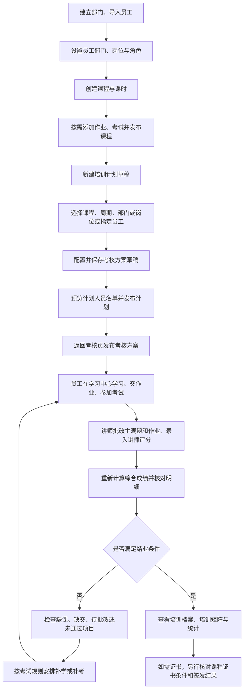

# 管理员操作流程与功能收敛

更新日期：2026-09-28。依据当前页面与服务代码整理，适用于本地自部署版本；不代表正式业务验收通过。

## 一、先理解三个对象

- 课程：可重复使用的视频、文档、课时、作业和考试内容。
- 培训计划：指定谁在什么时间内学习哪些课程。一次培训可包含多门课程。
- 考核方案：指定本次培训如何计分、各项权重与通过线，需要单独保存和发布。

## 二、完整流程

课程完成、考核通过、培训结业、证书签发是不同状态。学习进度达到 100% 不等于已经结业或已发证。补考需要考试配置允许，并受开放时间与次数限制。

## 三、管理员具体操作

| 顺序 | 当前入口 | 操作及检查点 |
| --- | --- | --- |
| 1 | 部门管理 `/admin?view=departments` | 建立部门，检查上下级、部门负责人及启用状态。 |
| 2 | 员工管理 `/admin?view=employees` → 导入员工 | 新员工先通过导入入口加入企业，再设置工号、部门、岗位、在职状态与角色。员工管理页的“导入员工”进入批量导入流程，返回及导入完成后回到员工管理。导入后还应检查账号加入/激活状态。 |
| 3 | 课程 `/org/coursera-test/courses` | 创建课程，添加课时和资料；按需添加考试与作业，设置题目、分值、考试开放时间及补考策略。课程发布后才能用于培训计划。 |
| 4 | 培训计划 `/admin/plans` | 创建草稿，选择已发布课程、培训周期及目标人员。可按部门、岗位或指定员工选择；保存草稿。 |
| 5 | 培训考核 `/admin/assessment` | 从计划页进入对应考核，配置考试、作业、讲师评分、学习进度等实际需要的项目，设置通过线。权重合计必须为 100，考试/作业项关联对应内容；先保存考核草稿。 |
| 6 | 培训计划 `/admin/plans` → 培训考核 | 返回计划草稿，预览分配名单、核对人数与人员，并确认发布计划；随后返回考核页发布考核方案。服务端要求先发布计划再发布考核。计划发布后如需追加员工，使用补录功能；不要假设后加入部门的员工会自动参加。 |
| 7 | 学习中心 `/lms`，管理工作台 `/admin` | 员工按任务学习、提交作业和考试。管理员检查培训进度和待批改记录，有批改权限的人员进入提交详情处理。 |
| 8 | 培训考核 `/admin/assessment` | 录入讲师评分，必要时重新计算综合成绩，逐项检查成绩来源、缺项和结业结果。分数调整需填写原因。 |
| 9 | 培训矩阵 `/admin/matrix`、统计 `/admin/statistics` | 矩阵可按员工姓名、计划筛选，并导出当前筛选的 Excel；统计看完成情况、成绩等汇总。员工可在自己的学习档案中查看结果。 |

复用已有计划时，选择计划后点击“复制为新草稿”，填写新的名称与编号、核对日期和人员后保存。此操作只预填课程与指派规则，不会直接发布，也不会复制成绩、考核方案或证书。

以上 `coursera-test` 是当前本地企业标识，正式部署应使用实际企业地址。

### 第一次试用

用一个测试部门、两名测试员工、一门短课程和一个培训计划跑完整流程。一人正常学习交卷，一人保留未完成状态；核对分配人数、学习待办、评分、未完成原因、结业与统计是否一致。不要在历史正式培训记录上反复改分试验。

### 管理员日常

1. 打开工作台，查看近期到期计划、未完成情况与待批改内容。
2. 处理需要自己批改或录入的评分，核对结业结果。
3. 在培训计划和矩阵中检查具体人员，联系相关员工或负责人补齐事项。
4. 需要汇报时查看统计，区分未开始、进行中、已完成和未通过。

## 四、功能收敛决定

已落实组织管理、培训管理、培训结果分组；媒体和标签进入课程页二级导航；员工页增加导入入口；培训班退出主菜单；自部署账户菜单隐藏上游反馈、更新、帮助和文档。其余条目仍作为后续收敛边界，不代表底层模块或历史数据已经删除。

| 处理 | 范围 | 理由或落点 |
| --- | --- | --- |
| 保留主流程 | 工作台、员工与部门、课程、培训计划、培训考核、结果查询 | 支撑完整内部培训闭环。 |
| 合并入口 | 员工导入与员工资料管理 | 新增、分配部门和角色应能在同一个员工管理入口找到。 |
| 收入二级入口 | 培训矩阵、培训档案、统计 | 统一归入培训结果，减少主菜单数量；保留各自的数据口径。 |
| 收入课程辅助入口 | 媒体资源、标签、题库 | 服务课程制作，日常培训管理员无需一直看到独立主菜单。 |
| 从常用主流程撤出 | 上游培训班 | 内部培训统一以培训计划分配任务；确认历史培训班的使用情况后再处理数据，不直接删除已有记录。 |
| 从企业产品入口舍弃 | 外部展示组件、营销门户装修、售课推广、订阅升级、上游反馈及产品帮助入口 | 不属于本企业内部培训日常流程。组件入口已不在当前企业主导航，其余入口仍需逐一收敛。 |
| 继续暂停 | AI 功能、钉钉实际接入 | AI 暂不展示；钉钉尚未完成企业应用与管理员授权，不能作为员工开户或登录前提。 |

## 五、当前体验缺口

- 员工导入沿用邮箱和 CSV 模板，当前不是手机号或工号开户；导入后仍需核对邀请状态并设置部门、岗位。
- 培训档案仍分布在现有考核及学员页面，尚未新增独立的管理端档案汇总页面。
- 课程编辑仍有独立章节侧栏；返回“课程”可回企业课程列表。
- 部分上游页面和外部测试封面仍存在中文或资源加载问题。
- 正式环境部署、真实员工试用及业务签收仍待完成。

## 六、界面参考

参考 [PlayEdu 管理端导航源码](https://github.com/PlayEdu/PlayEdu/blob/main/playedu-admin/src/compenents/left-menu/index.tsx) 的业务分组，以及 [部门管理](https://github.com/PlayEdu/PlayEdu/blob/main/playedu-admin/src/pages/department/index.tsx) 与 [课程列表](https://github.com/PlayEdu/PlayEdu/blob/main/playedu-admin/src/pages/course/index.tsx) 的操作组织。当前采用现有 Svelte 组件实现企业自己的导航，未复制 PlayEdu 页面源码或品牌素材。后续页面遵循中文标题、查询区与操作区分离、就近主操作、明确状态、操作后回到所属模块的原则。
